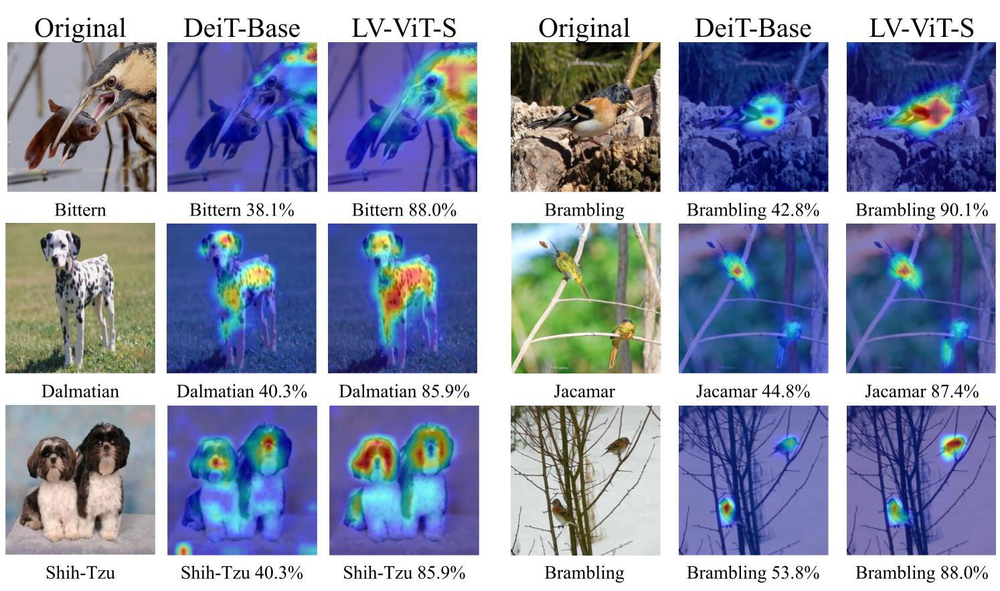

# All Tokens Matter: Token Labeling for Training Better Vision Transformers ([arxiv](https://arxiv.org/abs/2104.10858))

This is a Pytorch implementation of our paper. 


Comparison between the proposed LV-ViT and other recent works based on transformers. Note that we only show models whose model sizes are under 100M.

Our codes are based on the [pytorch-image-models](https://github.com/rwightman/pytorch-image-models) by [Ross Wightman](https://github.com/rwightman).

### Update

**2021.6: Support `pip install tlt` to use our Token Labeling Toolbox for image models.**

**2021.6: Release training code and segmentation model.**

**2021.4: Release LV-ViT models.**

#### LV-ViT Models

| Model                           | layer | dim  | Image resolution |  Param  | Top 1 |Download |
| :------------------------------ | :---- | :--- | :--------------: |-------: | ----: |   ----: |
| LV-ViT-S                        | 16    | 384  |       224        |  26.15M |  83.3 |[link](https://github.com/zihangJiang/TokenLabeling/releases/download/1.0/lvvit_s-26M-224-83.3.pth.tar) |
| LV-ViT-S                        | 16    | 384  |       384        |  26.30M |  84.4 |[link](https://github.com/zihangJiang/TokenLabeling/releases/download/1.0/lvvit_s-26M-384-84.4.pth.tar) |
| LV-ViT-M                        | 20    | 512  |       224        |  55.83M |  84.0 |[link](https://github.com/zihangJiang/TokenLabeling/releases/download/1.0/lvvit_m-56M-224-84.0.pth.tar) |
| LV-ViT-M                        | 20    | 512  |       384        |  56.03M |  85.4 |[link](https://github.com/zihangJiang/TokenLabeling/releases/download/1.0/lvvit_m-56M-384-85.4.pth.tar) |
| LV-ViT-M                        | 20    | 512  |       448        |  56.13M |  85.5 |[link](https://github.com/zihangJiang/TokenLabeling/releases/download/1.1/lvvit_m-56M-448-85.5.pth.tar) |
| LV-ViT-L                        | 24    | 768  |       448        | 150.47M |  86.2 |[link](https://github.com/zihangJiang/TokenLabeling/releases/download/1.0/lvvit_l-150M-448-86.2.pth.tar) |
| LV-ViT-L                        | 24    | 768  |       512        | 150.66M |  86.4 |[link](https://github.com/zihangJiang/TokenLabeling/releases/download/1.0/lvvit_l-150M-512-86.4.pth.tar) |

#### Requirements

torch>=1.4.0
torchvision>=0.5.0
pyyaml
scipy
timm==0.4.5

data prepare: ImageNet with the following folder structure, you can extract imagenet by this [script](https://gist.github.com/BIGBALLON/8a71d225eff18d88e469e6ea9b39cef4).

```
│imagenet/
├──train/
│  ├── n01440764
│  │   ├── n01440764_10026.JPEG
│  │   ├── n01440764_10027.JPEG
│  │   ├── ......
│  ├── ......
├──val/
│  ├── n01440764
│  │   ├── ILSVRC2012_val_00000293.JPEG
│  │   ├── ILSVRC2012_val_00002138.JPEG
│  │   ├── ......
│  ├── ......
```

#### Validation
Replace DATA_DIR with your imagenet validation set path and MODEL_DIR with the checkpoint path
```
CUDA_VISIBLE_DEVICES=0 bash eval.sh /path/to/imagenet/val /path/to/checkpoint
```

#### Label data

We provide NFNet-F6 generated dense label map [here](https://drive.google.com/file/d/1Cat8HQPSRVJFPnBLlfzVE0Exe65a_4zh/view?usp=sharing). As NFNet-F6 are based on pure ImageNet data, no extra training data is involved.


#### Training

Train the LV-ViT-S: 

If only 4 GPUs are available,

```
CUDA_VISIBLE_DEVICES=0,1,2,3 ./distributed_train.sh 4 /path/to/imagenet --model lvvit_s -b 256 --apex-amp --img-size 224 --drop-path 0.1 --token-label --token-label-data /path/to/label_data --token-label-size 14 --model-ema
```

If 8 GPUs are available: 
```
CUDA_VISIBLE_DEVICES=0,1,2,3,4,5,6,7 ./distributed_train.sh 8 /path/to/imagenet --model lvvit_s -b 128 --apex-amp --img-size 224 --drop-path 0.1 --token-label --token-label-data /path/to/label_data --token-label-size 14 --model-ema
```


Train the LV-ViT-M and LV-ViT-L (run on 8 GPUs):


```
CUDA_VISIBLE_DEVICES=0,1,2,3,4,5,6,7 ./distributed_train.sh 8 /path/to/imagenet --model lvvit_m -b 128 --apex-amp --img-size 224 --drop-path 0.2 --token-label --token-label-data /path/to/label_data --token-label-size 14 --model-ema
```
```
CUDA_VISIBLE_DEVICES=0,1,2,3,4,5,6,7 ./distributed_train.sh 8 /path/to/imagenet --model lvvit_l -b 128 --lr 1.e-3 --aa rand-n3-m9-mstd0.5-inc1 --apex-amp --img-size 224 --drop-path 0.3 --token-label --token-label-data /path/to/label_data --token-label-size 14 --model-ema
```
If you want to train our LV-ViT on images with 384x384 resolution, please use `--img-size 384 --token-label-size 24`.

#### Fine-tuning

To Fine-tune the pre-trained LV-ViT-S on images with 384x384 resolution:
```
CUDA_VISIBLE_DEVICES=0,1,2,3,4,5,6,7 ./distributed_train.sh 8 /path/to/imagenet --model lvvit_s -b 64 --apex-amp --img-size 384 --drop-path 0.1 --token-label --token-label-data /path/to/label_data --token-label-size 24 --lr 5.e-6 --min-lr 5.e-6 --weight-decay 1.e-8 --finetune /path/to/checkpoint
```

To Fine-tune the pre-trained LV-ViT-S on other datasets without token labeling:
```
CUDA_VISIBLE_DEVICES=0,1,2,3,4,5,6,7 ./distributed_train.sh 8 /path/to/dataset --model lvvit_s -b 64 --apex-amp --img-size 224 --drop-path 0.1 --token-label --token-label-size 14 --dense-weight 0.0 --num-classes $NUM_CLASSES --finetune /path/to/checkpoint
```

### Segmentation

Our Segmentation model are fully based upon the [MMSegmentation](https://github.com/open-mmlab/mmsegmentation) Toolkit. The model and config files are under `seg/` folder which follow the same folder structure. You can simply drop in these file to get start.

```shell
git clone https://github.com/open-mmlab/mmsegmentation # and install

cp seg/mmseg/models/backbones/vit.py mmsegmentation/mmseg/models/backbones/
cp -r seg/configs/lvvit mmsegmentation/configs/

# test upernet+lvvit_s (add --aug-test to test on multi scale)
cd mmsegmentation
./tools/dist_test.sh configs/lvvit/upernet_lvvit_s_512x512_160k_ade20k.py /path/to/checkpoint 8 --eval mIoU [--aug-test]
```

| Backbone                        | Method  | Crop size | Lr Schd |  mIoU   |  mIoU(ms) | Pixel Acc.| Param |Download |
| :------------------------------ | :------ | :-------- | :------ |:------- |:--------- | :-------- | :---- | :------ |
| LV-ViT-S                        | UperNet |  512x512  |   160k  |  47.9   |    48.6   |   83.1    |  44M  |[link](https://github.com/zihangJiang/TokenLabeling/releases/download/v1.1-seg/upernet_lvvit_s.pth) |
| LV-ViT-M                        | UperNet |  512x512  |   160k  |  49.4   |    50.6   |   83.5    |  77M  |[link](https://github.com/zihangJiang/TokenLabeling/releases/download/v1.1-seg/upernet_lvvit_m.pth) |
| LV-ViT-L                        | UperNet |  512x512  |   160k  |  50.9   |    51.8   |   84.1    |  209M |[link](https://github.com/zihangJiang/TokenLabeling/releases/download/v1.1-seg/upernet_lvvit_l.pth) |


### Visualization

We apply the visualization method in this [repo](https://github.com/hila-chefer/Transformer-Explainability) to visualize the parts of the image that led to a certain classification for DeiT-Base and our LV-ViT-S. The parts of the image that used by the network to make the decision are highlighted in red.



#### Reference
If you use this repo or find it useful, please consider citing:
```
@article{jiang2021all,
  title={All Tokens Matter: Token Labeling for Training Better Vision Transformers},
  author={Jiang, Zihang and Hou, Qibin and Yuan, Li and Zhou, Daquan and Shi, Yujun and Jin, Xiaojie and Wang, Anran and Feng, Jiashi},
  journal={arXiv preprint arXiv:2104.10858},
  year={2021}
}
```

#### Related projects
[T2T-ViT](https://github.com/yitu-opensource/T2T-ViT/), [Re-labeling ImageNet](https://github.com/naver-ai/relabel_imagenet), [MMSegmentation](https://github.com/open-mmlab/mmsegmentation), [Transformer Explainability](https://github.com/hila-chefer/Transformer-Explainability).
